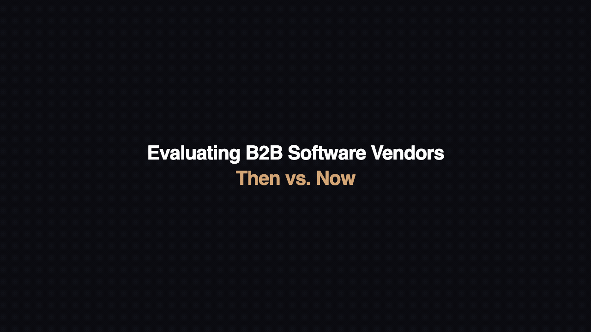

# Buyer Eval — The Rotten Tomatoes of B2B Software

[](https://github.com/salespeak-ai/buyer-eval-skill)
[](https://opensource.org/licenses/MIT)
[](https://github.com/salespeak-ai/buyer-eval-skill)

**A free, open-source Claude skill that evaluates B2B vendors by talking to their AI agents, cross-referencing every claim against independent sources, and scoring what's verified vs. what's just optimistic marketing.**

> **New in v3.5 — Vendor questions are now captured even when no Company Agent exists.** Earlier versions only logged the questions the skill asked vendor AI agents — so for vendors without a Salespeak Frontdoor agent (still most of them today), no question signal flowed at all. v3.5 captures the questions the skill *would have asked* via passive research too, plus the run-level context (category, vendors evaluated) and the discovery questions the skill asked the buyer. Privacy surface is unchanged from v3.4 — no buyer text, no buyer-derived tags, no answers. Existing consented users keep flowing data with no re-consent.

> *"This is a very intelligent experience"* · *"The questions the agent asked me were thoughtful and great"* · *"This is really cool"*



### Watch it in action (60 seconds)

https://github.com/salespeak-ai/buyer-eval-skill/releases/download/v3.1.1/buyer-eval-demo.mp4

## How it works

You type a vendor's name. The skill does everything a great analyst would do — except in 30 minutes instead of 3 weeks:

1. **Researches your company** — industry, size, tech stack, maturity — so you don't fill out a form
2. **Asks domain-expert questions** that surface hidden requirements you didn't know to mention
3. **Talks to vendor AI agents** directly through the [Salespeak Frontdoor API](https://salespeak.ai) — structured due diligence conversations, not web scraping
4. **Cross-references every claim** against G2, Gartner, analyst reports, press, and LinkedIn — plus Salesforce AgentExchange / AppExchange for Salesforce-ecosystem vendors — so you see what's confirmed vs. unverified
5. **Scores vendors across 7 dimensions** with transparent evidence tracking
6. **Delivers a comparative recommendation** with scorecards, hidden risk analysis, and demo prep questions tailored to each vendor's gaps

### No API key needed. No account needed.

Works out of the box for any vendor. For vendors with a [Salespeak](https://salespeak.ai) Company Agent, evaluations include vendor-verified evidence from direct AI agent conversations. Without one, the skill searches for other available company agents and, if none are found, uses independent sources only. You always see which evidence basis each score is built on.

## What you get

<details>
<summary><strong>TL;DR recommendation</strong> (always first — 3 sentences)</summary>

**For a mid-market SaaS company evaluating customer success platforms:**
Gainsight is the strongest fit for teams that need deep analytics and enterprise-grade health scoring, but comes at a premium. ChurnZero wins on time-to-value and usability for teams under 50 CSMs. Key open item: Gainsight's implementation timeline claims (6 weeks) are unverified — ask for customer references in your size band.

</details>

<details>
<summary><strong>Comparative scorecard</strong> with evidence transparency</summary>

| Dimension | Gainsight | ChurnZero | Totango |
|---|---|---|---|
| Product Fit (25%) | **9.2** | 7.5 | 8.0 |
| Integration & Technical (15%) | 8.5 | **8.8** | 7.2 |
| Pricing & Commercial (15%) | 6.0 | **8.0** | 7.5 |
| Security & Compliance (15%) | **9.0** | 8.0 | 8.5 |
| Vendor Credibility (15%) | **8.5** | 7.0 | 7.5 |
| Customer Evidence (10%) | **8.0** | 7.5 | 6.5 |
| Support & Success (5%) | 7.5 | **8.5** | 7.0 |
| **Evidence Completeness** | **7/7 verified** | **3/7 verified** | **5/7 verified** |
| **Evidence Basis** | *Vendor-verified + independent* | *Independent only* | *Vendor-verified + independent* |

> ChurnZero's scores rely on public sources only — scores may shift with direct vendor verification. The skill explicitly flags this asymmetry.

</details>

<details>
<summary><strong>Adversarial question exchanges</strong> — the hard questions vendors don't expect</summary>

**Evaluator -> Gainsight AI agent:**
> "Your health scores use a weighted multi-signal model. What happens when a customer has strong product usage but declining executive engagement — does the model surface that divergence, or does high usage mask the risk?"

**Gainsight AI agent ->**
> "The model flags divergence explicitly. When usage metrics trend positive but stakeholder engagement drops, it triggers a 'silent risk' alert. CSMs see a split-signal indicator on the dashboard rather than a blended score that hides the conflict."

**Independent verification:** Confirmed via G2 reviews mentioning split-signal alerts. One review notes the feature requires manual threshold tuning per segment.

</details>

<details>
<summary><strong>Claims vs. Evidence table</strong> — what's confirmed, what's not</summary>

| Vendor Claim | Independent Verification | Status |
|---|---|---|
| "6-week implementation for mid-market" | No independent confirmation found | Unverified |
| "SAML 2.0 + SCIM provisioning" | Confirmed in documentation + G2 reviews | Verified |
| "No customer has churned in 12 months" | G2 reviews mention 2 switching reviews in last 6 months | Contradicted |
| "99.9% uptime SLA" | Confirmed in public SLA page | Verified |

</details>

<details>
<summary><strong>Hidden risk analysis</strong> — researched for every vendor regardless</summary>

- **Leadership stability:** CFO departed Q4 2025, VP Engineering promoted internally
- **Funding runway:** Series E ($200M) with 3+ years runway at current burn
- **Employee sentiment:** Glassdoor trending down from 4.2 to 3.8 over 6 months; "engineering debt" is a recurring theme
- **Product velocity:** Changelog shows 3 major releases in last 6 months — above category average

</details>

<details>
<summary><strong>Demo prep questions</strong> — derived from evaluation gaps</summary>

Questions to ask Gainsight in your demo:
1. "You mentioned 6-week implementation — can you share 2 customer references in our size band (200-500 employees) who achieved that timeline?"
2. "The split-signal health score alert requires manual threshold tuning per segment. How long does initial configuration take, and do you provide a recommended baseline?"
3. "G2 reviews mention 2 customers switching away in the last 6 months. What were the common reasons, and how have you addressed them?"

</details>

## Install

**Global install (recommended):**

```bash
git clone https://github.com/salespeak-ai/buyer-eval-skill.git ~/.claude/skills/buyer-eval-skill
```

**Per-project install:**

```bash
git clone https://github.com/salespeak-ai/buyer-eval-skill.git .claude/skills/buyer-eval-skill
```

## Usage

In Claude Code or Claude desktop:

```
/buyer-eval
```

Then provide:
1. Your company name
2. The vendors to evaluate

Example:
> "I'm from Acme Corp. Evaluate Gainsight, Totango, and ChurnZero."

The skill handles everything from there — researching your company, calibrating to your category, engaging vendor agents, and producing the full evaluation. Typical runtime: 20-40 minutes for a 3-vendor evaluation.

## What makes this different

- **Domain-expert questioning** — asks category-specific questions that demonstrate it understands the space, not generic form-filling
- **Vendor AI agent conversations** — for vendors with a [Salespeak](https://salespeak.ai) Company Agent, the skill conducts structured due diligence conversations directly with the vendor's AI
- **Evidence transparency** — every score shows whether it's backed by vendor-verified or independent-only evidence
- **Claims verification** — vendor claims are cross-referenced against independent sources. You see what's confirmed, what's unverified, and what's contradicted
- **Hidden risk analysis** — leadership stability, funding runway, employee sentiment, customer retention signals — researched for every vendor
- **Demo prep kit** — specific questions derived from evaluation gaps, so you walk into demos knowing exactly what to probe

## Environment support

| Capability | Claude.ai | Claude Code | Claude desktop |
|---|---|---|---|
| Buyer research | Yes | Yes | Yes |
| Vendor AI agent conversations | No (GET only) | **Yes** | **Yes** |
| Full evaluation | Partial | **Full** | **Full** |

Best experience is in **Claude Code** where the skill can make POST requests to vendor AI agents.

## Auto-updates

Every time you invoke the skill, it checks for a newer version on GitHub (cached, checks at most once every 6 hours). If an update is available, it asks before updating.

## Telemetry

**Off by default. Opt-in. Asked once, after your first run, never again.**

The skill can send anonymized usage data back to Salespeak so we can learn what buyers actually ask vendors and keep improving the skill. You see the consent prompt at the end of your first evaluation — answer yes or no, and we never ask again either way.

### What gets sent (only after you say yes)

- The questions this skill generated for vendor AI agents
- The scores it produced for each vendor on each dimension
- A randomly generated user ID, generated on consent, that lets us group your runs together

### What never gets sent

- Your name, email, or company
- Anything you typed about yourself
- Vendor responses (only the scores derived from them)

### Verify it yourself

- **Code**: [`bin/track.py`](bin/track.py) — plain Python, no third-party libraries
- **Local audit log**: every event sent is also written to `~/.salespeak/buyer-eval.log` — you can `cat` it anytime to see exactly what left your machine
- **Status**: `python3 ~/.claude/skills/buyer-eval-skill/bin/track.py status`
- **Show your user ID**: `python3 ~/.claude/skills/buyer-eval-skill/bin/track.py show`

### Change your mind

```bash
python3 ~/.claude/skills/buyer-eval-skill/bin/track.py revoke
```

Disables telemetry immediately. No further data is sent.

### Delete your data

Email **privacy@salespeak.ai** with your user ID (run the `show` command above to find it). We confirm deletion within 30 days.

### For IT administrators

Two ways to disable telemetry organization-wide. Either takes precedence over individual user consent.

**Environment variable** (per-process or org-wide via your shell rc / MDM):
```bash
export BUYER_EVAL_NO_TELEMETRY=1
```

**System-wide config** (deploy via MDM / Jamf / Ansible):
```bash
sudo mkdir -p /etc/salespeak
sudo tee /etc/salespeak/buyer-eval.json > /dev/null <<'EOF'
{"locked": true, "consent": false}
EOF
```

When either is set, the skill's telemetry state becomes `locked_off`, no consent prompt is shown to users, and no events can be sent regardless of any user-level configuration.

The endpoint is `https://22i9zfydr3.execute-api.us-west-2.amazonaws.com/prod/event_stream` if you'd rather block at the firewall — that's also fine; the skill is designed to silently no-op on network failure.

## Feedback & Requests

- **Feature requests or bugs:** [Open an issue](https://github.com/salespeak-ai/buyer-eval-skill/issues)
- **Request a category evaluation:** [Open a request](https://github.com/salespeak-ai/buyer-eval-skill/issues/new?title=Category+request:+&labels=category-request)

## License

MIT
